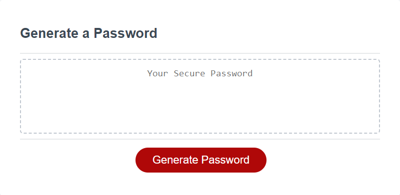
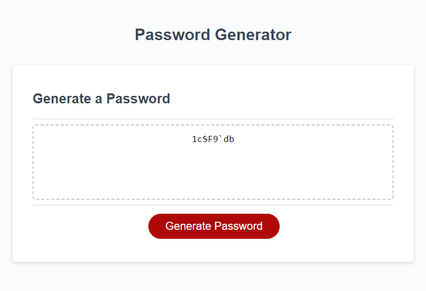

# Password Generator

## Description

This password generator helps the user to create a random password based on specified criteria. The user can input the required password length and the type of characters that can be included: uppercase, lowercase, numbers, and special symbols. Secured passwords are important to access sentive data.

## Installation

N/A

## Usage

**Website link: (https://anabel-espinoza.github.io/Password-Generator/)**

1. The password generator starts working when the user clicks the 'Generate Password' red button.
2. The user will be requested to enter password length with a value between 8-128. 
    - If the user enters text or decimal numbers, a message will be presented, asking to enter only whole numbers. 
    - If the user enters a number outside the interval, a message will be presented asking for the number to be within 8-128 characters. 
The user must click the 'Generate Password' button again and enter a valid input for the generator to display the next prompts.
3. Four more prompts are presented to the user asking for the type of characters that can be included in the password: lowercase, uppercase, numbers, and special symbols. At least one of those types must be selected to be able to generate a password. In the case the user doesn't select at least 1 type of characters, then a message will let the user know the reason the password is not generated.
4. After the prompts have been answered properly by the user, the generated password will appear on the webpage inside the dotted box.

The website looks like the following image (images without and with a randomly generated password):

## Credits

- HTML and CSS files, and JS starter code provided by GA Tech Bootcamp.
- JS file by: Anabel Espinoza (https://github.com/Anabel-Espinoza)

## License

- MIT License.
---
